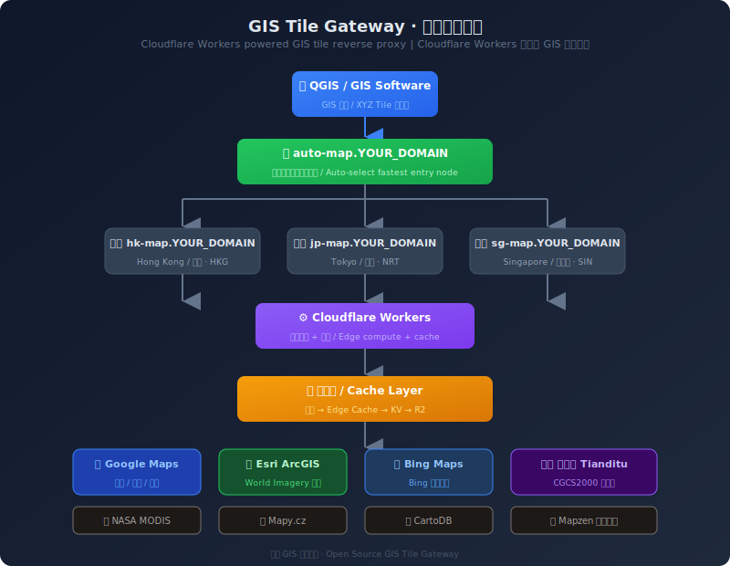

# 🌍 GIS Tile Gateway

<p align="center">
  
  
  
  
</p>

> **Cloudflare Workers 驱动的 GIS 瓦片反向代理网关**
> **A Cloudflare Workers powered GIS tile reverse proxy gateway**

[English](#english) | [中文](#chinese)

---

## 🇨🇳 中文

### 📖 项目简介

**GIS Tile Gateway** 是一个基于 Cloudflare Workers 的 GIS 瓦片反向代理网关，让你可以在 QGIS、奥维地图等 GIS 软件中**直接使用 Google 卫星影像、Esri 卫星、Bing 卫星、天地图等图源**，无需科学上网。

#### 核心功能

| 功能 | 说明 |
|------|------|
| 🚀 **智能加速** | 自动选择最快 Cloudflare 节点中转 |
| 🔄 **自动回退** | Google 超时自动切到 Esri/Bing |
| 🗺️ **多图源** | 支持 Google / Esri / Bing / 天地图 / NASA 等 |
| 💾 **多层缓存** | Memory → Edge Cache → KV → R2 |
| 🔐 **Token 安全** | 简单有效的访问控制 |
| 🎯 **QGIS 原生支持** | 提供 XML 配置，一键导入 |
| 🌐 **全球加速** | Cloudflare 310+ 城市节点 |

#### 架构图

<p align="center">
  
</p>

---

### 🚀 快速开始

#### 前提条件

- 一个 **Cloudflare 账号**（免费版即可）→ [注册](https://dash.cloudflare.com/sign-up)
- 一个 **域名**（托管在 Cloudflare）→ [教程](https://developers.cloudflare.com/fundamentals/get-started/setup/add-a-domain/)
- 一个 **QGIS** 软件（可选）→ [下载](https://qgis.org/)

#### 部署步骤（共 5 步，约 10 分钟）

##### 第 1 步：DNS 添加 4 条记录

登录 Cloudflare Dashboard → 你的域名 → **DNS** → **添加记录**

| 类型 | 名称 | IPv4 地址 | 代理 |
|------|------|-----------|------|
| A | `hk-map` | `192.0.2.1` | ☁️ 橙色 |
| A | `jp-map` | `192.0.2.1` | ☁️ 橙色 |
| A | `sg-map` | `192.0.2.1` | ☁️ 橙色 |
| A | `auto-map` | `192.0.2.1` | ☁️ 橙色 |

> IP 可以随便填，橙云模式下 Cloudflare 会忽略实际 IP。

##### 第 2 步：创建 Worker 1 — gis-tile-worker

Cloudflare Dashboard → **Workers & Pages** → **创建应用程序** → **创建 Worker**

- 名称：`gis-tile-worker`
- 删除默认代码，粘贴 `work.js` 全部内容
- 点击 **部署**

##### 第 3 步：创建 Worker 2 — auto-map-worker

再次点击 **创建应用程序** → **创建 Worker**

- 名称：`auto-map-worker`
- 粘贴 `auto-map-worker.js` 全部内容
- 点击 **部署**

##### 第 4 步：添加路由

进入 **gis-tile-worker** → **触发器** → **路由** → **添加路由**

添加 3 条路由：

| 路由 | Worker |
|------|--------|
| `hk-map.YOUR_DOMAIN/*` | gis-tile-worker |
| `jp-map.YOUR_DOMAIN/*` | gis-tile-worker |
| `sg-map.YOUR_DOMAIN/*` | gis-tile-worker |

进入 **auto-map-worker** → **触发器** → **路由** → **添加路由**

| 路由 | Worker |
|------|--------|
| `auto-map.YOUR_DOMAIN/*` | auto-map-worker |

> 把 `YOUR_DOMAIN` 替换成你的实际域名，例如 `ycwx.kdns.fr`

##### 第 5 步：验证部署

浏览器打开：

```
https://auto-map.YOUR_DOMAIN/health?token=YOUR_TOKEN
```

看到 `{"status":"ok"}` 就说明部署成功。

测试瓦片（浏览器会显示一张卫星图）：

```
https://auto-map.YOUR_DOMAIN/google?lyrs=s&x=257&y=257&z=9&token=YOUR_TOKEN
```

---

### 🗺️ QGIS 配置

#### 方式一：导入 XML（推荐）

1. 下载 `QGIS_Tile_Collection.xml`
2. 用文本编辑器打开，将所有 `YOUR_DOMAIN` 替换为你的实际域名
3. 将所有 `YOUR_TOKEN` 替换为你的实际 Token
4. QGIS → **浏览器面板** → 右键 **XYZ Tiles** → **加载连接** → 选择 XML

#### 方式二：手动添加

QGIS → **浏览器面板** → 右键 **XYZ Tiles** → **新建连接**

```
名称: 自动卫星
URL: https://auto-map.YOUR_DOMAIN/auto-satellite?x={x}&y={y}&z={z}&token=YOUR_TOKEN
最大缩放级别: 19
```

---

### 🔧 配置说明

#### 环境变量

| 变量 | 说明 | 默认值 |
|------|------|--------|
| `MY_TOKEN` | 访问令牌 | `YOUR_TOKEN` |
| `TILE_CACHE` | KV 命名空间绑定（可选） | — |
| `TILE_R2` | R2 存储桶绑定（可选） | — |

#### Token 安全

所有瓦片请求必须在 URL 末尾携带 `token` 参数：

```
https://auto-map.YOUR_DOMAIN/google?lyrs=s&x=257&y=257&z=9&token=YOUR_TOKEN
```

建议将 `YOUR_TOKEN` 改为一个复杂的随机字符串。

---

### ☁️ 高级功能

#### 绑定 KV 持久缓存（可选）

1. Cloudflare → **Workers & Pages** → **KV** → **创建命名空间**
   - 名称：`TILE_CACHE`
2. 进入 **auto-map-worker** → **设置** → **变量** → **KV 命名空间绑定**
   - 变量名称：`TILE_CACHE`
   - KV 命名空间：`TILE_CACHE`
3. 同样的操作绑定到 **gis-tile-worker**

#### 绑定 R2 永久仓库（可选）

1. Cloudflare → **R2** → **创建存储桶**
   - 名称：`tile-cache`
2. 进入 **auto-map-worker** → **设置** → **变量** → **R2 存储桶绑定**
   - 变量名称：`TILE_R2`
   - 存储桶：`tile-cache`

#### 使用 wrangler CLI 部署

```bash
# 安装 wrangler
npm install -g wrangler

# 登录
wrangler login

# 部署 gis-tile-worker
wrangler deploy -c wrangler-gis.toml

# 部署 auto-map-worker
wrangler deploy -c wrangler-auto.toml
```

---

### 📋 可用图源

| 源 | 类型 | 坐标系 | 说明 |
|------|------|--------|------|
| 自动卫星 | 卫星影像 | WGS-84 | 自动选 Google/Esri/Bing 最快 |
| Google 卫星 | 卫星影像 | WGS-84 | 高分辨率 |
| Google 卫星混合 | 卫星+标注 | WGS-84 | 带地名标注 |
| Google 历史影像 | 历史卫星 | WGS-84 | 时间回溯 |
| Google 矢量 | 矢量地图 | WGS-84 | 道路/建筑 |
| Google 地形 | 地形图 | WGS-84 | 等高线 |
| Esri 卫星 | 卫星影像 | WGS-84 | 全球覆盖 |
| Bing 卫星 | 卫星影像 | WGS-84 | 高分辨率 |
| 天地图卫星 | 卫星影像 | **CGCS2000** | 国内首选 |
| 天地图矢量 | 矢量地图 | **CGCS2000** | 国内道路/地名 |
| NASA MODIS | 卫星影像 | EPSG:4326 | 每日更新 |
| Mapzen 地形 | DEM | WGS-84 | 高程数据 |

---

### ⚠️ 常见问题

#### 瓦片加载超时

首次加载需要从上游图源抓取，等待 5~30 秒是正常的。第二次加载同一区域会从缓存返回，速度提升 5~10 倍。

#### 天地图无法加载

天地图使用浏览器端 API Key，有日调用量限制。建议：
1. 去 [天地图控制台](https://console.tianditu.gov.cn) 申请自己的 Key
2. 在 `work.js` 和 `auto-map-worker.js` 中替换 `YOUR_TIANDITU_KEY`

#### 自动卫星返回 503

三个图源都失败了。检查 Worker 日志：
**gis-tile-worker** → **日志** → 查看 Google/Esri/Bing 的失败原因

#### 如何修改 Token

在 `work.js` 和 `auto-map-worker.js` 中搜索 `YOUR_TOKEN`，替换为你的自定义 Token，然后重新部署。

---

### 📄 文件说明

| 文件 | 说明 |
|------|------|
| `work.js` | 主瓦片服务 Worker（路由到 hk/jp/sg） |
| `auto-map-worker.js` | 自动入口选择 Worker（路由到 auto-map） |
| `QGIS_Tile_Collection.xml` | QGIS 导入配置文件 |
| `wrangler-gis.toml` | wrangler CLI 配置（gis-tile-worker） |
| `wrangler-auto.toml` | wrangler CLI 配置（auto-map-worker） |
| `architecture.svg` | 架构图 |
| `LICENSE` | MIT 开源协议 |

---

### 📜 开源协议

本项目基于 MIT 协议开源。使用本项目时请遵守各图源的使用条款：

- Google 地图：Google Maps/Google Earth Additional Terms of Service
- Esri：ArcGIS Online 使用条款
- Bing：Bing Maps 使用条款
- 天地图：天地图服务条款
- NASA：NASA Open Data Policy

---

## 🇬🇧 English

### 📖 Introduction

**GIS Tile Gateway** is a Cloudflare Workers-based GIS tile reverse proxy gateway. It allows you to use Google Satellite, Esri, Bing, Tianditu and other tile sources directly in QGIS, OvitalMap, and other GIS software without a VPN.

#### Features

| Feature | Description |
|---------|-------------|
| 🚀 **Smart Acceleration** | Auto-select fastest Cloudflare edge node |
| 🔄 **Auto Fallback** | If Google times out, auto-switch to Esri/Bing |
| 🗺️ **Multiple Sources** | Google / Esri / Bing / Tianditu / NASA |
| 💾 **Multi-layer Cache** | Memory → Edge Cache → KV → R2 |
| 🔐 **Token Security** | Simple but effective access control |
| 🎯 **QGIS Native** | One-click XML import |

#### Architecture

<p align="center">
  
</p>

---

### 🚀 Quick Start

#### Prerequisites

- A **Cloudflare account** (free tier) → [Sign up](https://dash.cloudflare.com/sign-up)
- A **domain** hosted on Cloudflare → [Guide](https://developers.cloudflare.com/fundamentals/get-started/setup/add-a-domain/)
- **QGIS** (optional) → [Download](https://qgis.org/)

#### Deployment (5 steps, ~10 minutes)

**Step 1: Add 4 DNS records**

Cloudflare Dashboard → Your domain → **DNS** → **Add record**

| Type | Name | IPv4 | Proxy |
|------|------|------|-------|
| A | `hk-map` | `192.0.2.1` | ☁️ Proxied |
| A | `jp-map` | `192.0.2.1` | ☁️ Proxied |
| A | `sg-map` | `192.0.2.1` | ☁️ Proxied |
| A | `auto-map` | `192.0.2.1` | ☁️ Proxied |

**Step 2: Create Worker 1 — gis-tile-worker**

**Workers & Pages** → **Create application** → **Create Worker**

- Name: `gis-tile-worker`
- Paste `work.js` content
- Click **Deploy**

**Step 3: Create Worker 2 — auto-map-worker**

**Create application** → **Create Worker**

- Name: `auto-map-worker`
- Paste `auto-map-worker.js` content
- Click **Deploy**

**Step 4: Add routes**

**gis-tile-worker** → **Triggers** → **Routes** → **Add route**

| Route | Worker |
|-------|--------|
| `hk-map.YOUR_DOMAIN/*` | gis-tile-worker |
| `jp-map.YOUR_DOMAIN/*` | gis-tile-worker |
| `sg-map.YOUR_DOMAIN/*` | gis-tile-worker |

**auto-map-worker** → **Triggers** → **Routes** → **Add route**

| Route | Worker |
|-------|--------|
| `auto-map.YOUR_DOMAIN/*` | auto-map-worker |

**Step 5: Verify**

Open in browser:

```
https://auto-map.YOUR_DOMAIN/health?token=YOUR_TOKEN
```

Expected: `{"status":"ok"}`

---

### 🗺️ QGIS Setup

Download `QGIS_Tile_Collection.xml`, replace `YOUR_DOMAIN` and `YOUR_TOKEN`, then:

QGIS → **Browser** → Right-click **XYZ Tiles** → **Load Connections** → Select XML

---

### 📄 License

MIT License. Please comply with each tile source's terms of service when using this project.