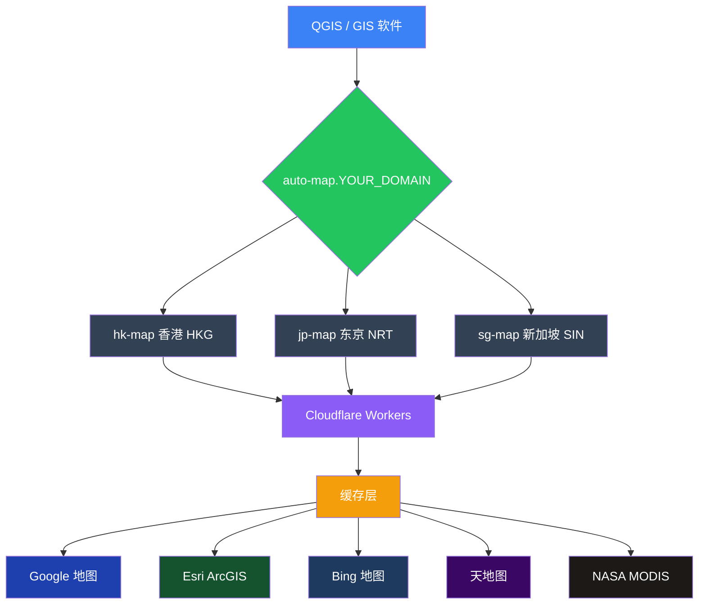

<p align="center">
  <picture>
    <source media="(prefers-color-scheme: dark)" srcset="https://img.shields.io/badge/GIS%20Tile%20Gateway-v1.0.0-8b5cf6?style=for-the-badge&logo=cloudflare&logoColor=white&labelColor=1e293b">
    
  </picture>
</p>

<p align="center">
  <a href="https://github.com/348864255/gis-tile-gateway/stargazers">
    
  </a>
  <a href="https://github.com/348864255/gis-tile-gateway/network">
    
  </a>
  <a href="https://github.com/348864255/gis-tile-gateway/issues">
    
  </a>
  
  
  
</p>

<p align="center">
  <b>Cloudflare Workers 驱动的 GIS 瓦片反向代理网关</b><br>
  <i>A Cloudflare Workers powered GIS tile reverse proxy gateway</i><br>
  <a href="README_en.md">🇬🇧 English Version</a>
</p>

---

## 📋 目录

- [项目简介](#-项目简介)
- [核心功能](#-核心功能)
- [架构图](#-架构图)
- [快速开始](#-快速开始)
- [QGIS 配置](#-qgis-配置)
- [配置说明](#%EF%B8%8F-配置说明)
- [高级功能](#-高级功能)
- [可用图源](#-可用图源)
- [常见问题](#-常见问题)
- [文件说明](#-文件说明)
- [开源协议](#-开源协议)
- [致谢](#-致谢)

---

## 🚀 核心功能

| 功能 | 说明 |
|------|------|
| **智能加速** | 自动选择最快 Cloudflare 节点（HKG/NRT/SIN） |
| **自动回退** | Google 超时自动切到 Esri 或 Bing |
| **多图源** | 支持 Google / Esri / Bing / 天地图 / NASA |
| **多层缓存** | 内存 → Edge Cache → KV → R2 |
| **Token 安全** | 简单有效的访问控制 |
| **QGIS 原生支持** | 提供 XML 配置，一键导入 |
| **开源免费** | MIT 协议，自由使用和修改 |

---

## 🏗️ 架构图



<p align="center">
  <i>或查看 <a href="architecture.svg">完整架构图 SVG</a></i>
</p>

---

## 🚀 快速开始

### 前提条件

- ☁️ 一个 **Cloudflare 账号**（免费版即可）→ [注册](https://dash.cloudflare.com/sign-up)
- 🌐 一个 **域名**（托管在 Cloudflare）→ [教程](https://developers.cloudflare.com/fundamentals/get-started/setup/add-a-domain/)
- 🗺️ **QGIS** 软件（可选）→ [下载](https://qgis.org/)

### 部署步骤

<details>
<summary><b>第 1 步：DNS 添加 4 条记录</b>（2 分钟）</summary>

Cloudflare Dashboard → 你的域名 → **DNS** → **添加记录**

| 类型 | 名称 | IPv4 地址 | 代理 |
|------|------|-----------|------|
| `A` | `hk-map` | `192.0.2.1` | ✅ 橙色云 |
| `A` | `jp-map` | `192.0.2.1` | ✅ 橙色云 |
| `A` | `sg-map` | `192.0.2.1` | ✅ 橙色云 |
| `A` | `auto-map` | `192.0.2.1` | ✅ 橙色云 |

> IP 可以随便填，橙云模式下 Cloudflare 会忽略实际 IP。

</details>

<details>
<summary><b>第 2 步：创建 Worker 1 — gis-tile-worker</b>（2 分钟）</summary>

1. **Workers & Pages** → **创建应用程序** → **创建 Worker**
2. 名称：`gis-tile-worker`
3. 删除默认代码，粘贴 `work.js` 全部内容
4. 点击 **部署**

</details>

<details>
<summary><b>第 3 步：创建 Worker 2 — auto-map-worker</b>（2 分钟）</summary>

1. **创建应用程序** → **创建 Worker**
2. 名称：`auto-map-worker`
3. 粘贴 `auto-map-worker.js` 全部内容
4. 点击 **部署**

</details>

<details>
<summary><b>第 4 步：添加路由</b>（2 分钟）</summary>

**gis-tile-worker** → **触发器** → **路由** → **添加路由**

| 路由 | Worker |
|------|--------|
| `hk-map.YOUR_DOMAIN/*` | gis-tile-worker |
| `jp-map.YOUR_DOMAIN/*` | gis-tile-worker |
| `sg-map.YOUR_DOMAIN/*` | gis-tile-worker |

**auto-map-worker** → **触发器** → **路由** → **添加路由**

| 路由 | Worker |
|------|--------|
| `auto-map.YOUR_DOMAIN/*` | auto-map-worker |

> 把 `YOUR_DOMAIN` 替换成你的实际域名（例如 `example.com`）

</details>

<details>
<summary><b>第 5 步：验证部署</b>（1 分钟）</summary>

浏览器打开：

```bash
# 健康检查
https://auto-map.YOUR_DOMAIN/health?token=YOUR_TOKEN

# 期望返回
{"status":"ok","service":"GIS Tile Gateway v1.0","colo":"HKG"}

# 测试瓦片（浏览器会显示一张卫星图）
https://auto-map.YOUR_DOMAIN/google?lyrs=s&x=257&y=257&z=9&token=YOUR_TOKEN
```

</details>

---

## 🗺️ QGIS 配置

### 方式一：导入 XML（推荐）

```bash
# 1. 下载 QGIS_Tile_Collection.xml
# 2. 用文本编辑器替换 YOUR_DOMAIN 和 YOUR_TOKEN
# 3. 在 QGIS 中导入
```

QGIS → **浏览器面板** → 右键 **XYZ Tiles** → **加载连接** → 选择 XML 文件

### 方式二：手动添加

QGIS → **浏览器面板** → 右键 **XYZ Tiles** → **新建连接**

| 字段 | 值 |
|------|-----|
| 名称 | `自动卫星` |
| URL | `https://auto-map.YOUR_DOMAIN/auto-satellite?x={x}&y={y}&z={z}&token=YOUR_TOKEN` |
| 最大缩放 | `19` |

---

## ⚙️ 配置说明

### 环境变量

| 变量 | 类型 | 说明 | 默认值 |
|------|------|------|--------|
| `MY_TOKEN` | 配置 | 访问令牌 | `YOUR_TOKEN` |
| `TILE_CACHE` | KV 绑定 | 持久缓存（可选） | — |
| `TILE_R2` | R2 绑定 | 永久存储（可选） | — |

### Token 安全

所有瓦片请求必须在 URL 末尾携带 `token` 参数：

```url
https://auto-map.YOUR_DOMAIN/google?lyrs=s&x=257&y=257&z=9&token=YOUR_TOKEN
```

> ⚠️ **安全提示**：建议将 `YOUR_TOKEN` 改为复杂的随机字符串，使用密码生成器生成。

---

## ☁️ 高级功能

<details>
<summary><b>绑定 KV 持久缓存</b></summary>

1. Cloudflare → **Workers & Pages** → **KV** → **创建命名空间** → 名称：`TILE_CACHE`
2. **auto-map-worker** → **设置** → **变量** → **KV 命名空间绑定**
   - 变量名称：`TILE_CACHE` → KV 命名空间：`TILE_CACHE`
3. 同样的操作绑定到 **gis-tile-worker**

</details>

<details>
<summary><b>绑定 R2 永久仓库</b></summary>

1. Cloudflare → **R2** → **创建存储桶** → 名称：`tile-cache`
2. **auto-map-worker** → **设置** → **变量** → **R2 存储桶绑定**
   - 变量名称：`TILE_R2` → 存储桶：`tile-cache`

</details>

<details>
<summary><b>使用 wrangler CLI 部署</b></summary>

```bash
# 安装 wrangler
npm install -g wrangler

# 登录 Cloudflare
wrangler login

# 部署 Worker
wrangler deploy -c wrangler-gis.toml
wrangler deploy -c wrangler-auto.toml
```

</details>

---

## 📋 可用图源

| 源 | 类型 | 坐标系 | 说明 |
|------|------|--------|------|
| **自动卫星** ⭐ | 卫星影像 | WGS-84 | 自动选最快图源 |
| Google 卫星 | 卫星影像 | WGS-84 | 高分辨率 |
| Google 混合 | 卫星+标注 | WGS-84 | 带地名标注 |
| Google 历史影像 | 历史卫星 | WGS-84 | 时间回溯 |
| Google 矢量 | 矢量地图 | WGS-84 | 道路/建筑 |
| Google 地形 | 地形图 | WGS-84 | 等高线 |
| Esri 卫星 | 卫星影像 | WGS-84 | 全球覆盖 |
| Bing 卫星 | 卫星影像 | WGS-84 | 高分辨率 |
| **天地图卫星** | 卫星影像 | **CGCS2000** | 国内首选 |
| **天地图矢量** | 矢量地图 | **CGCS2000** | 国内道路/地名 |
| NASA MODIS | 卫星影像 | EPSG:4326 | 每日更新 |
| Mapzen 地形 | DEM | WGS-84 | 高程数据 |

---

## ⚠️ 常见问题

<details>
<summary><b>🔄 瓦片加载超时</b></summary>

首次加载需要从上游图源抓取，等待 5~30 秒是正常的。  
第二次加载同一区域会从缓存返回，速度提升 5~10 倍。

</details>

<details>
<summary><b>🇨🇳 天地图无法加载</b></summary>

天地图使用浏览器端 API Key，有日调用量限制。

1. 去 [天地图控制台](https://console.tianditu.gov.cn) 申请自己的 Key
2. 在 `work.js` 和 `auto-map-worker.js` 中替换 `YOUR_TIANDITU_KEY`

</details>

<details>
<summary><b>❌ 自动卫星返回 503</b></summary>

三个图源都失败了。检查 Worker 日志：  
**gis-tile-worker** → **日志** → 查看 Google/Esri/Bing 的失败原因

</details>

<details>
<summary><b>🔑 如何修改 Token</b></summary>

在 `work.js` 和 `auto-map-worker.js` 中搜索 `YOUR_TOKEN`，替换为你的自定义 Token，然后重新部署两个 Worker。

</details>

---

## 📁 文件说明

```
gis-tile-gateway/
├── README.md                 # 中文文档（本文件）
├── README_en.md              # 英文文档
├── architecture.svg          # 架构图
├── work.js                   # 主瓦片服务 Worker（路由到 hk/jp/sg）
├── auto-map-worker.js        # 自动入口选择 Worker（路由到 auto-map）
├── QGIS_Tile_Collection.xml  # QGIS 导入配置文件
├── wrangler-gis.toml         # wrangler CLI 配置（gis-tile-worker）
├── wrangler-auto.toml        # wrangler CLI 配置（auto-map-worker）
└── LICENSE                   # MIT 开源协议
```

---

## 📜 开源协议

本项目基于 **MIT 协议** 开源。使用本项目时请遵守各图源的使用条款：

| 图源 | 条款 |
|------|------|
| Google Maps | [Google Maps/Google Earth Additional Terms of Service](https://cloud.google.com/maps-platform/terms) |
| Esri | [ArcGIS Online Terms of Service](https://www.esri.com/en-us/legal/terms/full-master-agreement) |
| Bing Maps | [Bing Maps Terms of Service](https://www.microsoft.com/en-us/maps/product/terms) |
| 天地图 | [天地图服务条款](https://www.tianditu.gov.cn/about/term.html) |
| NASA | [NASA Open Data Policy](https://www.nasa.gov/open/) |

---

## 🤖 致谢

本项目由 **AI 辅助编写**，感谢人工智能时代带来的技术变革：

- 🧠 **DeepSeek V4 Flash** — 中国深度求索 1M 长上下文模型（实际使用的 AI 模型）
- 💻 **Claude Code** — Anthropic 桌面客户端（使用的 IDE 工具）

在 AI 的帮助下，原本需要数周开发的项目在数小时内完成。从架构设计、代码编写、调试优化到文档撰写，AI 全程参与。

**致敬 AI 时代 — 让创意不再受限于技术门槛。**

---

<p align="center">
  <sub>Made with ❤️ for GIS & Remote Sensing</sub><br>
  <sub>
    <a href="https://github.com/348864255/gis-tile-gateway/issues">报告 Bug</a> ·
    <a href="https://github.com/348864255/gis-tile-gateway/issues">请求功能</a> ·
    <a href="README_en.md">🇬🇧 English Version</a>
  </sub>
</p>