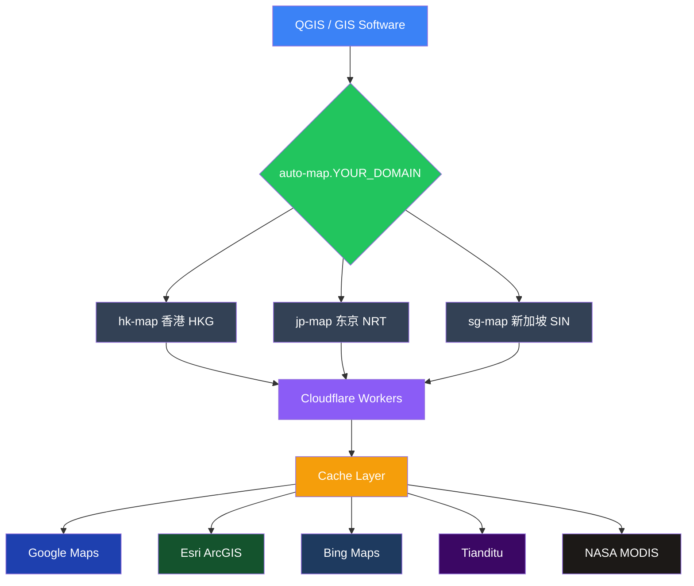

<p align="center">
  <picture>
    <source media="(prefers-color-scheme: dark)" srcset="https://img.shields.io/badge/GIS%20Tile%20Gateway-v1.0.0-8b5cf6?style=for-the-badge&logo=cloudflare&logoColor=white&labelColor=1e293b">
    
  </picture>
</p>

<p align="center">
  <a href="https://github.com/348864255/gis-tile-gateway/stargazers">
    
  </a>
  <a href="https://github.com/348864255/gis-tile-gateway/network">
    
  </a>
  <a href="https://github.com/348864255/gis-tile-gateway/issues">
    
  </a>
  
  
  
</p>

<p align="center">
  <b>A Cloudflare Workers powered GIS tile reverse proxy gateway</b><br>
  <i>Cloudflare Workers 驱动的 GIS 瓦片反向代理网关</i><br>
  <a href="README.md">🇨🇳 中文版</a>
</p>

---

## 📋 Table of Contents

- [Features](#-features)
- [Architecture](#-architecture)
- [Quick Start](#-quick-start)
- [QGIS Setup](#-qgis-setup)
- [Configuration](#%EF%B8%8F-configuration)
- [Advanced Features](#-advanced-features)
- [Available Tile Sources](#-available-tile-sources)
- [Troubleshooting](#-troubleshooting)
- [File Structure](#-file-structure)
- [License](#-license)
- [Acknowledgments](#-acknowledgments)

---

## 🚀 Features

| Feature | Description |
|---------|-------------|
| **Smart Acceleration** | Auto-selects fastest Cloudflare edge node (HKG/NRT/SIN) |
| **Auto Fallback** | Google times out? Auto-switches to Esri or Bing |
| **Multiple Sources** | Google / Esri / Bing / Tianditu / NASA / Mapy.cz |
| **Multi-layer Cache** | Memory → Edge Cache → KV → R2 |
| **Token Security** | Simple but effective access control |
| **QGIS Native** | One-click XML import for QGIS |
| **Open Source** | MIT licensed, free to use and modify |

---

## 🏗️ Architecture



<p align="center">
  <i>Or view the <a href="architecture.svg">full architecture diagram</a></i>
</p>

---

## 🚀 Quick Start

### Prerequisites

- ☁️ A **Cloudflare account** (free tier works) → [Sign up](https://dash.cloudflare.com/sign-up)
- 🌐 A **domain** hosted on Cloudflare → [Guide](https://developers.cloudflare.com/fundamentals/get-started/setup/add-a-domain/)
- 🗺️ **QGIS** (optional) → [Download](https://qgis.org/)

### Deployment

<details>
<summary><b>Step 1: Add 4 DNS records</b> (2 minutes)</summary>

Cloudflare Dashboard → Your domain → **DNS** → **Add record**

| Type | Name | IPv4 | Proxy |
|------|------|------|-------|
| `A` | `hk-map` | `192.0.2.1` | ✅ Proxied |
| `A` | `jp-map` | `192.0.2.1` | ✅ Proxied |
| `A` | `sg-map` | `192.0.2.1` | ✅ Proxied |
| `A` | `auto-map` | `192.0.2.1` | ✅ Proxied |

> The IP doesn't matter — Cloudflare ignores it when proxied (orange cloud).
>
</details>

<details>
<summary><b>Step 2: Create Worker 1 — gis-tile-worker</b> (2 minutes)</summary>

1. Go to **Workers & Pages** → **Create application** → **Create Worker**
2. Name: `gis-tile-worker`
3. Delete default code, paste `work.js` content
4. Click **Deploy**

</details>

<details>
<summary><b>Step 3: Create Worker 2 — auto-map-worker</b> (2 minutes)</summary>

1. **Create application** → **Create Worker**
2. Name: `auto-map-worker`
3. Paste `auto-map-worker.js` content
4. Click **Deploy**

</details>

<details>
<summary><b>Step 4: Add routes</b> (2 minutes)</summary>

**gis-tile-worker** → **Triggers** → **Routes** → **Add route**

| Route | Worker |
|-------|--------|
| `hk-map.YOUR_DOMAIN/*` | gis-tile-worker |
| `jp-map.YOUR_DOMAIN/*` | gis-tile-worker |
| `sg-map.YOUR_DOMAIN/*` | gis-tile-worker |

**auto-map-worker** → **Triggers** → **Routes** → **Add route**

| Route | Worker |
|-------|--------|
| `auto-map.YOUR_DOMAIN/*` | auto-map-worker |

> Replace `YOUR_DOMAIN` with your actual domain (e.g., `example.com`)

</details>

<details>
<summary><b>Step 5: Verify</b> (1 minute)</summary>

Open in your browser:

```bash
# Health check
https://auto-map.YOUR_DOMAIN/health?token=YOUR_TOKEN

# Expected response
{"status":"ok","service":"GIS Tile Gateway v1.0","colo":"HKG"}

# Test a tile (should show a satellite image)
https://auto-map.YOUR_DOMAIN/google?lyrs=s&x=257&y=257&z=9&token=YOUR_TOKEN
```

</details>

---

## 🗺️ QGIS Setup

### Method 1: Import XML (Recommended)

```bash
# 1. Download QGIS_Tile_Collection.xml
# 2. Replace YOUR_DOMAIN and YOUR_TOKEN with your actual values
# 3. In QGIS:
```

QGIS → **Browser** → Right-click **XYZ Tiles** → **Load Connections** → Select the XML file

### Method 2: Manual Add

QGIS → **Browser** → Right-click **XYZ Tiles** → **New Connection**

| Field | Value |
|-------|-------|
| Name | `Auto Satellite` |
| URL | `https://auto-map.YOUR_DOMAIN/auto-satellite?x={x}&y={y}&z={z}&token=YOUR_TOKEN` |
| Max Zoom | `19` |

---

## ⚙️ Configuration

### Environment Variables

| Variable | Type | Description | Default |
|----------|------|-------------|---------|
| `MY_TOKEN` | Config | Access token | `YOUR_TOKEN` |
| `TILE_CACHE` | KV Binding | Persistent cache (optional) | — |
| `TILE_R2` | R2 Binding | Permanent storage (optional) | — |

### Token Security

All tile requests must include the `token` parameter:

```url
https://auto-map.YOUR_DOMAIN/google?lyrs=s&x=257&y=257&z=9&token=YOUR_TOKEN
```

> ⚠️ **Security tip**: Change `YOUR_TOKEN` to a random string. Use a password generator for best results.

---

## ☁️ Advanced Features

<details>
<summary><b>Bind KV Persistent Cache</b></summary>

1. Cloudflare → **Workers & Pages** → **KV** → **Create namespace** → Name: `TILE_CACHE`
2. **auto-map-worker** → **Settings** → **Variables** → **KV Namespace Bindings**
   - Variable name: `TILE_CACHE` → KV namespace: `TILE_CACHE`
3. Repeat for **gis-tile-worker**

</details>

<details>
<summary><b>Bind R2 Permanent Storage</b></summary>

1. Cloudflare → **R2** → **Create bucket** → Name: `tile-cache`
2. **auto-map-worker** → **Settings** → **Variables** → **R2 Bucket Bindings**
   - Variable name: `TILE_R2` → Bucket: `tile-cache`

</details>

<details>
<summary><b>Deploy with wrangler CLI</b></summary>

```bash
# Install wrangler
npm install -g wrangler

# Login to Cloudflare
wrangler login

# Deploy workers
wrangler deploy -c wrangler-gis.toml
wrangler deploy -c wrangler-auto.toml
```

</details>

---

## 📋 Available Tile Sources

| Source | Type | CRS | Description |
|--------|------|-----|-------------|
| **Auto Satellite** ⭐ | Satellite | WGS-84 | Auto-selects fastest source |
| Google Satellite | Satellite | WGS-84 | High resolution |
| Google Hybrid | Hybrid | WGS-84 | Satellite + labels |
| Google History | Historical | WGS-84 | Time travel imagery |
| Google Vector | Vector | WGS-84 | Roads & buildings |
| Google Terrain | Terrain | WGS-84 | Contour lines |
| Esri Satellite | Satellite | WGS-84 | Global coverage |
| Bing Satellite | Satellite | WGS-84 | High resolution |
| **Tianditu Satellite** | Satellite | **CGCS2000** | China preferred |
| **Tianditu Vector** | Vector | **CGCS2000** | China roads/places |
| NASA MODIS | Satellite | EPSG:4326 | Daily updated |
| Mapzen Terrain | DEM | WGS-84 | Elevation data |

---

## ⚠️ Troubleshooting

<details>
<summary><b>🔄 Tile load timeout</b></summary>

First load fetches from upstream — 5~30 seconds is normal.  
Subsequent loads for the same area are served from cache (0.2~0.5s).

</details>

<details>
<summary><b>🇨🇳 Tianditu not loading</b></summary>

Tianditu uses a browser-side API Key with daily usage limits.

1. Get your own key at [Tianditu Console](https://console.tianditu.gov.cn)
2. Replace `YOUR_TIANDITU_KEY` in `work.js` and `auto-map-worker.js`

</details>

<details>
<summary><b>❌ Auto Satellite returns 503</b></summary>

All three providers failed. Check Worker logs:  
**gis-tile-worker** → **Logs** → Check Google/Esri/Bing errors

</details>

<details>
<summary><b>🔑 How to change the token</b></summary>

Search for `YOUR_TOKEN` in `work.js` and `auto-map-worker.js`, replace with your custom token, then redeploy both workers.

</details>

---

## 📁 File Structure

```
gis-tile-gateway/
├── README.md                 # Chinese documentation
├── README_en.md              # English documentation (this file)
├── architecture.svg          # Architecture diagram
├── work.js                   # Main tile worker (routes: hk/jp/sg)
├── auto-map-worker.js        # Auto entry selector (route: auto-map)
├── QGIS_Tile_Collection.xml  # QGIS import configuration
├── wrangler-gis.toml         # wrangler config for gis-tile-worker
├── wrangler-auto.toml        # wrangler config for auto-map-worker
└── LICENSE                   # MIT License
```

---

## 📜 License

This project is licensed under the **MIT License**.  
When using this project, please comply with each tile source's terms of service:

| Source | Terms |
|--------|-------|
| Google Maps | [Google Maps/Google Earth Additional Terms of Service](https://cloud.google.com/maps-platform/terms) |
| Esri | [ArcGIS Online Terms of Service](https://www.esri.com/en-us/legal/terms/full-master-agreement) |
| Bing Maps | [Bing Maps Terms of Service](https://www.microsoft.com/en-us/maps/product/terms) |
| Tianditu | [天地图服务条款](https://www.tianditu.gov.cn/about/term.html) |
| NASA | [NASA Open Data Policy](https://www.nasa.gov/open/) |

---

## 🤖 Acknowledgments

This project was **AI-assisted**. Grateful for the transformative power of the AI era:

- 🧠 **DeepSeek V4 Flash** — China's DeepSeek 1M long-context model (the actual AI model used)
- 💻 **Claude Code** — Desktop IDE by Anthropic (the development tool used)

With AI, what would have taken weeks was completed in hours — from architecture design, coding, debugging, to documentation.

**Salute to the AI era — where creativity is no longer limited by technical barriers.**

---

<p align="center">
  <sub>Made with ❤️ for GIS & Remote Sensing</sub><br>
  <sub>
    <a href="https://github.com/348864255/gis-tile-gateway/issues">Report Bug</a> ·
    <a href="https://github.com/348864255/gis-tile-gateway/issues">Request Feature</a> ·
    <a href="README.md">🇨🇳 中文版</a>
  </sub>
</p>